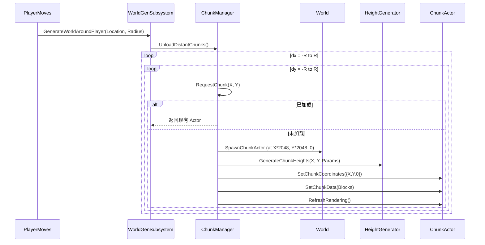

# 🌍 WorldGeneration 模块技术说明

## 🧩 一、模块基本信息

- **模块名称**：`WorldGeneration`
- **类型**：Unreal Engine 项目内建功能模块
- **核心目标**：实现**基于区块（Chunk）的无限体素世界动态生成**
- **关键技术**：
  - 区块化管理（16×16 格，每格 128cm → 每区块 2048cm）
  - 基于 FastNoise 的程序化地形生成
  - 动态加载/卸载（围绕玩家位置）
  - 异步配置加载（通过 `TSoftObjectPtr` + Asset Manager）
- **线程模型**：全在游戏线程执行（生成逻辑轻量，未使用后台线程）
- **依赖模块**：Core, CoreUObject, Engine, AssetManager
- **日志类别**:`LogWorldGeneration`
---

## 📦 二、核心类清单与职责

| 类名 | 类型 | 文件 | 职责 |
|------|------|------|------|
| `UWorldGenerationConfig` | `UDataAsset` | `WorldGenerationConfig.h/.cpp` | 存储世界生成参数（种子、高度、噪声设置等） |
| `UWorldGenerationSubsystem` | `UWorldSubsystem` | `WorldGenerationSubsystem.h/.cpp` | 公共入口，管理配置加载、触发生成 |
| `UChunkGenerationManager` | `UObject` | `ChunkGenerationManager.h/.cpp` | 区块生命周期管理（创建/缓存/卸载/填充体素） |
| `UHeightGenerator` | 静态工具类 | `HeightGenerator.h/.cpp` | 根据噪声生成 16×16 地表高度图 |
| `FastNoise` | 纯 C++ 类 | `FastNoise.h/.cpp` | 高性能噪声库（Perlin/Simplex/Value/Cellular 等） |
| `FWorldGenParams` | `USTRUCT` | `WorldGenerationConfig.h` | 配置的具体参数结构体 |
| `FChunkInterface` | `UINTERFACE` | （隐含） | 区块 Actor 必须实现的接口（`SetChunkCoordinates`, `SetChunkData`, `RefreshRendering`） |

> 💡 **注意**：系统要求每个区块 Actor 实现 `IChunkInterface`（通过 `Cast<IChunkInterface>` 检查）。

---

## 🔧 三、关键函数接口详解

### ✅ `UWorldGenerationSubsystem`（世界生成总控）

| 函数 | 线程 | 说明 |
|------|------|------|
| `SetChunkActorClass(TSubclassOf<AActor>)` | 游戏线程 | 设置用于代表区块的 Actor 类（必须实现 `IChunkInterface`） |
| `SetWorldConfig(TSoftObjectPtr<UWorldGenerationConfig>)` | 游戏线程 | **异步加载**配置资源（避免卡顿） |
| `GenerateWorldAroundPlayer(FVector, int32 Radius)` | 游戏线程 | **主入口**：围绕玩家生成/卸载区块（方形区域） |
| `OnWorldConfigLoaded` | 广播委托 | 配置加载完成时触发（可用于初始化 UI 或开始生成） |

> ⚠️ `GenerateWorldAroundPlayer` 是每帧或定期调用的核心函数（通常由玩家移动触发）。

---

### ✅ `UChunkGenerationManager`（区块管理中枢）

| 函数 | 说明 |
|------|------|
| `Initialize(UWorldGenerationConfig*)` | 初始化噪声与参数 |
| `RequestChunk(int32 X, int32 Y, UWorld*)` → `AActor*` | 请求区块（若存在则返回，否则创建） |
| `SpawnChunkActor(...)` | 在世界中生成区块 Actor（位置 = `ChunkX * 2048, ChunkY * 2048, 0`） |
| `GenerateChunkData(AActor*, X, Y)` | **核心生成逻辑**：调用 `UHeightGenerator` → 填充体素 ID 数组 |
| `UnloadDistantChunks(PlayerChunkPos, RenderDistance)` | 卸载超出 `(RenderDistance+1)^2` 距离的区块 |

> 🧱 **体素 ID 规则**（硬编码在 `GenerateChunkData` 中）：
> - `z == 0` → ID=2（原石）
> - `z == SurfaceZ` → ID=1（草方块）
> - `z ∈ [SurfaceZ-2, SurfaceZ)` → ID=7（泥土）
> - 其他 → ID=3（石头）

---

### ✅ `UHeightGenerator`（地形高度生成器）

| 函数 | 说明 |
|------|------|
| `GenerateChunkHeights(ChunkX, ChunkY, FWorldGenParams, OutHeights)` | 输出 256 个高度值（`x + y*16` 布局） |

> 🔊 内部使用 `FastNoise::GetSimplexFractal()` 生成基础地形，并叠加细节层。

---

### ✅ `FastNoise`（底层噪声引擎）

- 支持多种噪声类型：`Perlin`, `Simplex`, `Value`, `Cellular`, `Cubic` 及其分形变体（FBM/Billow/RigidMulti）
- 支持插值方式：`Linear`, `Hermite`, `Quintic`
- 支持 2D/3D/4D 噪声
- **完全无 UE 依赖**，可跨平台复用

---

## 🗃️ 四、数据结构定义

### `FWorldGenParams`（来自 `WorldGenerationConfig.h`）
```cpp
USTRUCT(BlueprintType)
struct FWorldGenParams
{
    GENERATED_BODY()

    UPROPERTY(EditAnywhere) int32 Seed = 12345;
    UPROPERTY(EditAnywhere) int32 WorldHeight = 128; // Z 方向最大高度
    UPROPERTY(EditAnywhere) float BaseFrequency = 0.01f;
    UPROPERTY(EditAnywhere) int32 Octaves = 6;
    UPROPERTY(EditAnywhere) float Lacunarity = 2.0f;
    UPROPERTY(EditAnywhere) float Gain = 0.5f;
    // ...（其他噪声参数）
};
```

### 区块坐标系统
- **世界坐标**：厘米单位（Unreal 默认）
- **区块坐标**：`(ChunkX, ChunkY)`，每个区块覆盖 `[ChunkX*2048, (ChunkX+1)*2048)` cm
- **区块内坐标**：`x ∈ [0,15]`, `y ∈ [0,15]`, `z ∈ [0, WorldHeight)`

---

## ⚙️ 五、关键流程：区块生成



---

## 🛠️ 六、使用示例（典型初始化流程）

```cpp
// 1. 获取子系统
UWorldGenerationSubsystem* WorldGen = GetWorld()->GetSubsystem<UWorldGenerationSubsystem>();

// 2. 设置区块类（必须实现 IChunkInterface）
WorldGen->SetChunkActorClass(YourVoxelChunkClass);

// 3. 异步加载配置
WorldGen->SetWorldConfig(TSoftObjectPtr<UWorldGenerationConfig>(YourConfigSoftRef));

// 4. 监听配置加载完成
WorldGen->OnWorldConfigLoaded.AddLambda([=]() {
    // 5. 开始生成世界（通常绑定到玩家移动）
    WorldGen->GenerateWorldAroundPlayer(PlayerLocation, 5);
});
```

---

## ✅ 七、设计亮点

1. **解耦良好**：配置、噪声、区块管理、渲染完全分离
2. **异步资源加载**：避免启动卡顿
3. **动态内存管理**：自动卸载远处区块，控制内存占用
4. **调试友好**：非 Shipping 版本绘制区块边界框（绿色）
5. **可扩展性强**：
   - 更换噪声类型只需改 `HeightGenerator`
   - 自定义体素填充规则只需改 `GenerateChunkData`
   - 支持垂直分块（预留 `Z=0` 接口）

---

## 🔜 八、优化与扩展建议

| 方向 | 建议 |
|------|------|
| **性能** | 将 `GenerateChunkData` 移至后台线程（需同步回游戏线程调用 `SetChunkData`） |
| **配置** | 增加生物群系（Biome）支持，不同区域用不同噪声参数 |
| **存储** | 与 `VoxelPersistence` 模块集成，保存已生成区块 |
| **渲染** | 当前为“立即刷新”，可加入延迟构建（减少卡顿） |
| **日志** | 将 `LogTemp` 替换为专属 `LogWorldGen` |
| **垂直分块** | 扩展 `FIntVector` 支持 Y-up 或多层地下世界 |

---

## 📎 附：系统依赖关系图（文字版）

```
[Gameplay]
     ↓
UWorldGenerationSubsystem
     ↓ (持有)
UChunkGenerationManager ←───┐
     ↓                      │
UHeightGenerator            │
     ↓                      │
FastNoise (纯 C++)          │
                            │
[Chunk Actor] ←─────────────┘ (通过 IChunkInterface 通信)
```

---
