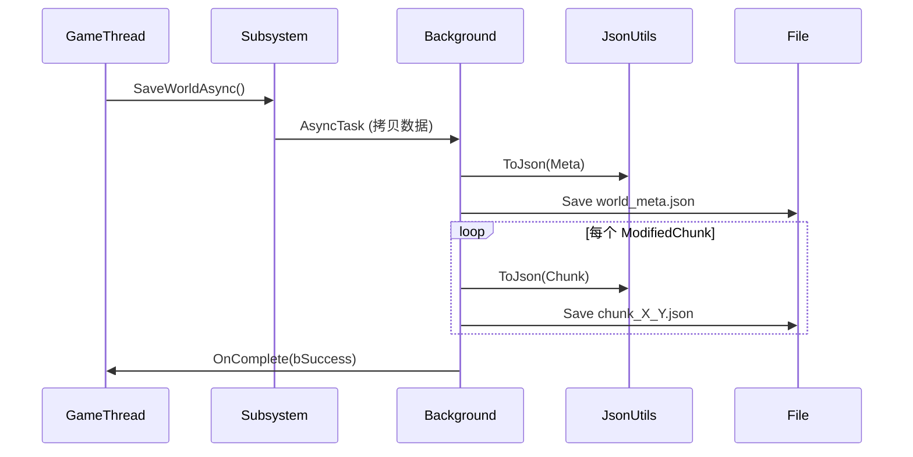

# 存档系统技术说明

## 🧩 一、模块基本信息

- **模块名称**：`VoxelPersistence`
- **类型**：Unreal Engine 项目内建功能模块
- **依赖**：Core, CoreUObject, Engine, Json, JsonUtilities
- **用途**：为体素世界提供**异步、区块级、JSON 格式**的持久化能力
- **线程模型**：游戏线程调用 → 后台线程 I/O → 回调至游戏线程
- **日志类别**：`LogVoxelPersistence`

---

## 📦 二、核心类清单与职责

| 类名 | 类型 | 文件 | 职责 |
|------|------|------|------|
| `FVoxelWorldMeta` | `USTRUCT` | `VoxelPersistenceTypes.h` | 世界元数据（种子、玩家位置、区块列表等） |
| `FVoxelChunkData` | `USTRUCT` | `VoxelPersistenceTypes.h` | 单个区块的体素数据（坐标 + ID 数组） |
| `FVoxelPersistencePaths` | 静态工具类 | `VoxelPersistencePaths.h/.cpp` | 统一生成存档路径（元数据/区块） |
| `FVoxelPersistenceJsonUtils` | 静态工具类 | `VoxelPersistenceJsonUtils.h/.cpp` | Struct ↔ JSON 双向转换 + 文件读写 |
| `UVoxelPersistenceSubsystem` | `UGameInstanceSubsystem` | `VoxelPersistenceSubsystem.h/.cpp` | 公共 API 入口，管理异步任务 |
| `FVoxelPersistence` | `FDefaultModuleImpl` | `VoxelPersistenceModule.h/.cpp` | 模块生命周期管理（启动/关闭日志） |

---

## 🔧 三、关键函数接口详解

### ✅ `UVoxelPersistenceSubsystem`（唯一公共入口）

| 函数 | 线程 | Blueprint | 说明 |
|------|------|-----------|------|
| `SaveWorldAsync(WorldName, Meta, ModifiedChunks, OnComplete)` | 游戏线程调用 | ✅ | **异步保存整个世界**，仅保存修改过的区块 |
| `LoadWorldMetaAsync(WorldName, OnComplete)` | 游戏线程调用 | ✅ | **异步加载元数据**（不含区块） |
| `LoadChunkSync(WorldName, ChunkPos, OutChunk)` | 游戏线程调用 | ✅ | **同步加载单个区块**（用于区块生成时回读） |
| `DoesWorldExist(WorldName)` | 任意 | ✅ (Pure) | 检查世界是否存在（通过 `world_meta.json` 判断） |

> ⚠️ 所有异步操作均在 `AnyBackgroundThreadNormalTask` 执行，完成后回调到 `GameThread`。

---

### ✅ `FVoxelPersistenceJsonUtils`（序列化核心）

| 函数 | 说明 |
|------|------|
| `ToJson(const FVoxelWorldMeta&)` → `TSharedPtr<FJsonObject>` | 序列化元数据 |
| `FromJson(Json, FVoxelWorldMeta&)` → `bool` | 反序列化元数据 |
| `ToJson(const FVoxelChunkData&)` → `TSharedPtr<FJsonObject>` | 序列化区块 |
| `FromJson(Json, FVoxelChunkData&)` → `bool` | 反序列化区块 |
| `SaveJsonToFile(FilePath, Json)` → `bool` | 同步写 JSON 到文件（自动创建目录） |
| `LoadJsonFromFile(FilePath, OutJson)` → `bool` | 同步从文件读 JSON |

> 💡 内部使用 `FJsonSerializer`，JSON 格式人类可读，便于调试。

---

### ✅ `FVoxelPersistencePaths`（路径规则）

| 函数 | 返回示例 |
|------|--------|
| `GetWorldSaveDir("MyWorld")` | `Saved/VoxelWorlds/MyWorld` |
| `GetMetaFilePath("MyWorld")` | `Saved/VoxelWorlds/MyWorld/world_meta.json` |
| `GetChunkFilePath("MyWorld", {0,0})` | `Saved/VoxelWorlds/MyWorld/chunks/chunk_0_0.json` |

> 📁 目录结构清晰分离元数据与区块数据。

---

## 🗃️ 四、数据结构与 JSON 映射

### `FVoxelWorldMeta` → JSON
```json
{
  "Version": 1,
  "Seed": 12345,
  "WorldName": "TestWorld",
  "PlayerLocation": [100.0, 200.0, 50.0],
  "PlayerRotation": [0.0, 90.0, 0.0],
  "LastSavedTime": "2025-12-20T20:00:00Z",
  "Chunks": [
    {"X": 0, "Y": 0},
    {"X": 1, "Y": 0}
  ]
}
```

### `FVoxelChunkData` → JSON
```json
{
  "X": 0,
  "Y": 0,
  "Blocks": [1, 0, 0, 2, ...]  // int32 数组，长度 = 16*16*Height
}
```

---

## ⚙️ 五、关键流程

### 1. **保存世界**


### 2. **加载世界**
- **Step 1**: 调用 `LoadWorldMetaAsync()` → 获取 `FVoxelWorldMeta`
- **Step 2**: 遍历 `Meta.ChunkList`，按需调用 `LoadChunkSync()` 加载区块

> ✅ **按需加载**：避免一次性加载全部区块，节省内存。

---

## 🛠️ 六、使用示例（C++）

```cpp
// 保存
auto* Persistence = GetGameInstance()->GetSubsystem<UVoxelPersistenceSubsystem>();
Persistence->SaveWorldAsync(
    "MyWorld",
    CurrentMeta,
    DirtyChunksMap,
    FOnVoxelWorldSaved::CreateLambda([](bool bOK) {
        if (bOK) UE_LOG(LogVoxelPersistence, Log, TEXT("Saved!"));
    })
);

// 加载
Persistence->LoadWorldMetaAsync("MyWorld", FOnVoxelWorldLoaded::CreateLambda([](bool bOK, const FVoxelWorldMeta& Meta) {
    if (bOK) {
        for (const FIntPoint& Pos : Meta.ChunkList) {
            FVoxelChunkData Chunk;
            if (Persistence->LoadChunkSync("MyWorld", Pos, Chunk)) {
                // 重建区块
            }
        }
    }
});
```

---

## ✅ 七、设计亮点

1. **完全异步 I/O**：不阻塞游戏线程
2. **增量保存**：仅保存 `ModifiedChunks`，提升性能
3. **强解耦**：各组件职责单一，易于测试与维护
4. **蓝图友好**：所有关键函数暴露给 Blueprint
5. **错误安全**：空输入检查 + 日志反馈
6. **路径统一**：避免硬编码，便于未来迁移（如云存储）

---

## 🔜 八、可扩展方向

- **压缩**：在 `SaveJsonToFile` 前对 `OutputString` 做 GZip
- **二进制格式**：替换 JSON 为自定义二进制协议（更快更小）
- **存档加密**：在写入前加密字符串
- **版本迁移**：在 `FromJson` 中加入 `switch(Version)`
- **自动保存**：在 Subsystem 中添加定时保存逻辑

---